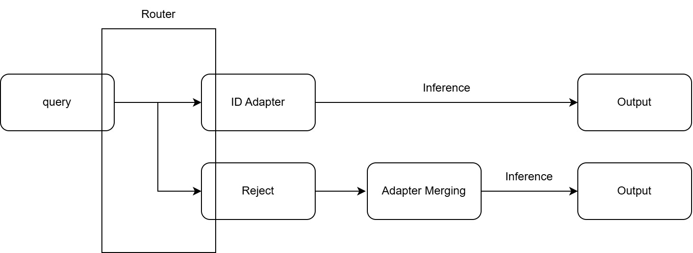

# SMoEA — Scalable Mixture-of-Experts Adapters



## 目錄結構

```
main.py                     系統入口：interactive / batch 兩模式
configs/default.yaml        全部設定唯一定義處（路徑、門檻、模型、生成參數；任何設定可用 --set key=value 臨時覆蓋）
router/                     路由決策層
  core.py                   Router 類別：build / save / load / decide / escalate / finalize——路由邏輯唯一所在
  config.py data_io.py      設定載入、資料與嵌入快取 I/O
  embedding.py              查詢嵌入（bge）
  fingerprint.py units.py   任務指紋、多質心、路由單位
  lexical.py conformal.py   詞彙一致性訊號、共形校準與四區判定
  verifier.py               送審 LLM 是非題裁決
  metrics.py                評測計分
system/                     路由之後的執行層
  inference.py              InferenceEngine：base model 常駐、per-task adapter 熱切換、生成
  rejection.py              拒絕分支（Model Merging）介面——互動／批次／benchmark 共用入口
  registry.py               可選拒絕方法的清單檔解析與驗證
  merged_model.py           權重檔契約：writer 與 validator 同住一處
  adapter_pool.py           pool150 清單解析、LoRA 載入、池指紋
  merging.py                本機建置 ta / ties_only / dare_ties_ta / pico_ta / lora_lego
  adamerging.py             adamerging_pp 的逐層係數最佳化
  lorahub.py                lorahub 的 CMA-ES 權重搜尋
  arrow_runtime.py          Arrow / Taskwise-K16 的資產驗證與逐 token 路由
  benchmark.py              15-OOD 載入與本地計分
scripts/
  check_env.py              環境體檢
  selftest_*.py             三支自測（零資料零 GPU）
  build_router_assets.py    路由資產離線建置（掃 dataset 自動推導任務集合）
  eval_router.py            路由評測三段
  eval_baseline_*.py        兩支 baseline
  eval_outputs_llm_judge.py 批次輸出的 LLM 評分
  merge_pool150.py          用本機 adapter 建置某個 condition 的權重檔
  fetch_artifact.py         自 Hugging Face 取得權重檔
  push_artifact.py          上傳權重檔到私有 Hugging Face repo
  migrate_artifact_manifest.py  修補舊版工具寫出的說明檔
  verify_against_producer.py    比對本機建置與參考版本
  smoke_rejection_methods.py    逐一確認每個拒絕方法都能服務
  run_rejection_benchmark.py    固定 15-OOD benchmark，跳過 Router
  verify_flow_table.py      評測結果獨立重放驗證
  plot_centroids.py         質心結構圖
dataset/                    資料（不進 git）；請建立 dataset 目錄以及 dataset/train_data/ 和 dataset/test_data/
  train_data/task{N}_train.json
  test_data/task{N}_test.json
adapter/task{N}/            LoRA adapters（不進 git）：請建立 adapter 目錄，將 task{N} 直接放在 adapter/ 下，task 內如有多個 checkpoint-*/ 自動取最新
assets/                     路由建置產物；unit_descriptions.json 為人工校訂的單位說明書
artifacts/                  拒絕分支的權重檔與 registry.json（不進 git）
results/                    評測與批次輸出
docs/                       架構圖與文件
```

## 環境建置與執行

1. git clone
```bash
   git clone https://github.com/Root88888/SMoEA.git && cd SMoEA
```
 
2. 放置檔案
   - 任務樣本：train 檔放 `dataset/train_data/`、test 檔放
     `dataset/test_data/`（檔名 `task{N}_train.json` / `task{N}_test.json`）
     
     ```bash
        cd ./
        pip install gdown
        
        mkdir -p dataset/train_data dataset/test_data
        
        gdown 1AsJwaqQ3AXmPT8TpAxOyvCPbyHtCi1lG -O dataset/train_data/train_data.zip
        gdown 1aiT9r9v2tyH-0cdf_F6zhfEvYF0mZ2tM -O dataset/test_data/test_data.zip
        
        python3 -m zipfile -e dataset/train_data/train_data.zip dataset/train_data/
        python3 -m zipfile -e dataset/test_data/test_data.zip  dataset/test_data/
     ```
   - adapters：每任務一個目錄，放成 `adapter/task{N}/`；解壓後若外層
     多包一層目錄，將其中的 `task*` 移出攤平

重要說明: 我在這個系統把原本的 OOD task149 稱為 task9149，以便跟 ID task149 區分，麻煩檔案就位後手動把 OOD task149 檔名改為 task9149_test.json

3. 一鍵建置
   
   已在 dataset/ood_tasks.txt 定義 OOD 任務有哪些，如果編號方式不同請修改

```bash
   bash scripts/setup_workspace.sh                                          # 只有 base
   bash scripts/setup_workspace.sh --artifacts fetch --hf-repo <org>/<repo> # 另外下載權重檔
   bash scripts/setup_workspace.sh --artifacts merge                        # 另外本機建置
```

   `--artifacts` 決定拒絕分支有哪些方法可用，不加就只有 base；詳見〈拒絕分支〉。

   自動完成：檔案檢查（缺漏會明確提示）、conda 環境建置與依賴安裝
   （首次 10-20 分鐘）、環境體檢、查詢嵌入計算與路由資產建置
   （首次 GPU 數分鐘）。結尾印出「全部就緒」即完成；中途停止時
   依提示處理後重跑即可（已完成步驟自動跳過）。
   
4. 單筆執行互動
```bash
   conda activate smoea
   python main.py --mode interactive
```

   首次執行自動下載生成與裁決模型（各約 16GB）。輸入任務內 query
   應看到 Router 判定與模型回答；輸入無關文字應看到進入
   Model Merging 分支的訊息（即 `system/rejection.py` 的呼叫點）。

   session 內可以切換拒絕方法，底層模型不重載：

   ```text
   :rejection              顯示目前使用哪一個
   :rejection list         列出可選的項目
   :rejection use ties_only  切換
   ```
 
5. 批次執行
```bash
   python main.py --mode batch          # --tasks a,b 只跑任務a,b、--limit n 每個任務test set只取前n筆，這些沒加就是全跑
   python main.py --mode batch --artifact ties_only   # 整批的拒絕樣本共用指定的方法
```
 
   逐筆結果（含 Router 診斷與模型輸出）落於
   `results/main_batch_outputs.jsonl`。每一筆拒絕樣本另記
   `rejection_condition_id` 與 `rejection_run_id`，可追溯到具體的權重。
 
之後每次開機僅需 `conda activate smoea`；步驟 2、3 為一次性作業。

## Router 說明

Router 的工作：每筆進來的 query，在 150 個任務中選出該用哪個 adapter，
或判定拒絕（拒絕後交給拒絕分支）。

判定核心是**共形 p 值**——query 與各任務的相似度領先差距（margin），放進離線建好的校準分數庫中同組內排名，換算成「這個領先程度在已知的同類任務中有多罕見」的機率值，
再依 p 值分區決定去向：

| 判定順序 | 條件 | 去向 |
|---|---|---|
| 直判 | margin > 0.10 | 直接路由 |
| 紅區 | p < 0.02 | 拒絕 |
| 綠區 | p ≥ 0.10 且嵌入與 TF-IDF 詞彙指紋的 top-1 unit 一致 | 路由 |
| 送審 | 其餘（p 落灰色地帶、或雙訊號不一致） | 慢速路徑 |

**快慢兩條路徑**：以上判定（嵌入＋相似度＋p 值＋詞彙檢查）為快路徑，
單筆約 50ms，多數樣本在此已決定路由結果；送審樣本進慢速路徑——裁決 LLM
（Llama-3.1-8B）對前 3 名候選任務各答一題是非題「這筆 query 是不是該任務的實例？」，最高信心 ≥ 0.5 就路由至該候選、三題都不像則拒絕，
LLM 判斷約 220ms，含快路徑合計約 270ms。

**路由單位（unit）**：指紋相似度 > 0.97 的攣生任務在建置時綁成同一個
路由單位（150 任務 → 146 單位，僅兩組三胞胎），其餘自己一個單位，
路由先選單位，路由的最後一步在單位內還原至相似度最高的成員任務。
評測因此分 task 級與 unit 級兩種準確率，攣生任務被送至同單位其它任務時
unit 級算對、task 級算錯。

**離線建置產物**：任務指紋與多質心
（k-means 分群，多樣態任務展開多質心）、路由單位表、共形校準分數庫
（與指紋堆 80/20 隔離切分）、TF-IDF 詞彙指紋、任務說明書（慢速路徑
的裁決依據）。新增任務只需重跑建置。

完整判定流程圖：[docs/router_flowchart.jpg](docs/router_flowchart.jpg)

## 測試集全量路由實測與評估 Routing Zone Outcome and Accuracy/Ablation/Baseline Comparison

### 1. 主評測

```bash
# 1a. 分區（CPU 數分鐘）：全部測試樣本分四區、產送審佇列
python scripts/eval_router.py --mode decide 2>&1 | tee results/eval_decide.txt

# 1b. 送審打分（GPU 數小時；中斷重跑自動續）：裁決 LLM 對佇列逐筆三題是非
python scripts/eval_router.py --mode score 2>&1 | tee results/eval_score.txt

# 1c. 結算
python scripts/eval_router.py --mode run 2>&1 | tee results/eval_run.txt
```

### 2. Ablation 變體資產準備（無多質心版；一次性）

```bash
mkdir -p assets_ablate_nomc
cp assets/emb_*.npz assets/unit_descriptions.json assets_ablate_nomc/
python scripts/build_router_assets.py \
    --set paths.assets_dir=assets_ablate_nomc --set fingerprint.k_max=1
```

### 3. 五個 Ablation 變體

```bash
for AB in gray_reject gray_route no_lexical no_direct no_multicentroid; do
  python scripts/eval_router.py --mode decide --ablate $AB
  python scripts/eval_router.py --mode score  --ablate $AB
  python scripts/eval_router.py --mode run    --ablate $AB
done
```

### 4. 兩支 Baseline

```bash
python scripts/eval_baseline_mean_embedding.py --mode eval --tau 0.72
python scripts/eval_baseline_bm25_voting.py    --mode eval --ratio_tau 0.5
```

### 5. 匯總數據

```bash
python scripts/export_report_data.py        # 輸出 results/report_data.json
```

## 拒絕分支（Model Merging）

Router 拒絕之後走這裡。所有方法共用同一個 base model（`unsloth/Meta-Llama-3.1-8B`），
差別只在往上疊什麼；疊加不改動 base model，所以方法之間切換不需要重新載入它。

> `base` 是其中一個方法的名字，意思是「什麼都不疊」；base model 則是那個共用的
> Llama-3.1-8B。兩者不同。

### 有哪些方法

**Baselines**——權重在開始生成前就固定，同樣的輸入得到同樣的輸出。

| `condition_id` | 做什麼 | 可當線上選項 | 可本機建置 |
|---|---|---|---|
| `base` | 什麼都不疊，直接由 base model 回答 | 可 | 不適用 |
| `ta` | Task Arithmetic：150 個 adapter 直接平均 | 可 | 可 |
| `pico_ta` | Task Arithmetic 之前先做一層低秩處理 | 可 | 可 |
| `ties_only` | 修剪成數值最大的部分座標、逐座標選方向、只留同向的貢獻。`only` 表示後面沒接最佳化，用來與 `adamerging_pp` 區分 | 可 | 可 |
| `dare_ties_ta` | 隨機丟棄、放大補回、取號投票，再接 Task Arithmetic。封板的丟棄比例是 0 | 可 | 可 |
| `lora_lego` | LoRA-Lego：把整個池的逐 rank 單元分群 | 可 | 可 |
| `adamerging_pp` | 以 TIES 當前處理，再對合併係數做最佳化 | 可 | 可（需 GPU 與 `dataset/train_data/`） |
| `lorahub` | 從 150 個挑 20 個，用 CMA-ES 搜尋權重。係數綁定特定示範樣本，**只能當 benchmark 的受測對象** | 不可 | 可（需 GPU 與示範樣本） |

**Arrow routing**——不預先合併。生成時逐 token 比對原型，只套用最接近的那個 expert，
每一層獨立判斷，因此不同請求走的路徑不一樣。

| `condition_id` | 候選數 | 需要的檔案 |
|---|---|---|
| `arrow` | 全部 150 個 adapter | 那 150 個 adapter，加一份事先算好的原型索引 |
| `taskwise_k16_arrow` | 16 個群代表 | 16 個代表 adapter 與索引（約 275 MB） |

這兩個是為「像訓練任務但沒見過」的請求設計的。面對差距很大的自由形式提問（寫詩、
閒聊之類），逐層獨立的路由可能各層挑到互不相關的 expert，輸出品質會明顯下降——這是
方法本身的性質，不是設定錯誤。要評估它們，用貼近任務型態的輸入或跑 15-OOD benchmark。

### 怎麼選

可選項目宣告在 `artifacts/registry.json`（`configs/default.yaml` 的預設值）。
**只有列在裡面的項目可以選**——系統不掃描目錄，也不會自己挑最新的 run。格式見
[`examples/artifact_registry.example.json`](examples/artifact_registry.example.json)。

切換前會完整檢查要換過去的那一份（格式、base model 指紋、dtype、檔案大小與雜湊值）；
檢查沒過就維持原本生效的那一個，不會退回 `base`。

清單檔不存在時不會出錯，只是沒有可選項目，拒絕分支就用 `system.rejection_method`
（預設 `base`）。

三個入口用法一致：

```bash
python main.py --mode interactive                       # session 內用 :rejection use <id>
python main.py --mode batch --artifact ties_only
python scripts/run_rejection_benchmark.py --artifact ties_only \
    --benchmark-root <資料根目錄> --output-dir results/rejection-ties_only
```

### 權重檔怎麼來

除了 `base` 之外每個方法各需要一個權重檔（dense delta 約 3.76 GB，`lorahub` 是 LoRA、
小很多）。兩條路等價，都只在準備階段執行——**服務執行中不會對外連線**。

**下載：**

```bash
hf auth login
python scripts/fetch_artifact.py --repo <org>/<repo> --condition ties_only --list
python scripts/fetch_artifact.py --repo <org>/<repo> --condition ties_only
```

`--list` 只查有哪些版本、不下載。同一個 condition 有多個版本時要用 `--run-id` 指定，
系統不會自己挑最新的。下載完會逐檔核對大小與雜湊值。

**本機建置：**

```bash
python scripts/merge_pool150.py --method ties_only
```

`--method` 七選一。前五個是純權重運算，CPU 也能跑；`adamerging_pp` 與 `lorahub` 要對
資料做最佳化，只能用 GPU：

```bash
python scripts/merge_pool150.py --method adamerging_pp
python scripts/merge_pool150.py --method lorahub \
    --examples <示範樣本.json> --run-seed 1
```

adapter 從設定檔的 `system.adapter_dir` 取（與 Router 用的是同一個值），不必另外
指定；adapter 放在別處時才用 `--adapter-dir` 或 `--manifest` 覆蓋。

超參數是固定的，使用者選方法不調參。同一批 adapter 建置過就不會重算。權重檔的編號取檔案本身雜湊的前 16 碼，**編號相同就保證內容相同**。

舊版工具產生的權重檔若缺欄位，先跑一次補寫（只改說明檔、不動權重）：

```bash
python scripts/migrate_artifact_manifest.py --scan <權重檔目錄> --dry-run
python scripts/migrate_artifact_manifest.py --scan <權重檔目錄>
```

### 確認每個方法都能服務

```bash
python scripts/smoke_rejection_methods.py --set system.dtype=bfloat16
```

逐一啟用清單檔裡的每個 condition、各生成一次、給總結表。**跳過 Router**，所以不受路由資產設定影響。`--only base,ties_only` 只測其中幾個。

## Benchmark：跳過 Router，只測某一個方法

```bash
python scripts/run_rejection_benchmark.py --artifact ties_only \
  --benchmark-root <benchmark 資料根目錄> \
  --output-dir results/rejection-ties_only \
  --set system.dtype=bfloat16 --smoke
```

固定 15-OOD：5 個 Natural Instructions、5 個 BBH、5 個 MMLU-Pro，完整執行 4,159 筆。
`--smoke` 每個家族只跑第一筆，用來確認流程通。它衡量的是拒絕分支本身，不是路由準確率；
用的是與互動、批次相同的引擎，只是換了資料來源並跳過 Router。

輸出 `ni_results.json`、`bbh_results.json`、`mmlu_pro_results.json` 與 `metrics.json`
（後者的 `rejection` 欄位記錄受測方法的身分）。本地計分包含分類準確率、ROUGE-L 與
BLEU；GPT judge 不會被自動呼叫。

要跑完整 benchmark 前，先執行一次 `python scripts/map_ood_aliases.py --dataset-dir dataset`
建立 OOD `task149` 的內部別名。

## 批次推論結果評測 (LLM-as-a-judge)

對批次推論的輸出以 OpenAI 模型閱卷：每筆將題目、標準答案、模型輸出
交給 LLM 評分——score 0–5（5=完全正確）、score≥4 計為正確
（is_correct），並附簡短評語。需自備 OpenAI API key。

要先產生批次推論結果 results/main_batch_outputs.jsonl or results/main_batch_outputs_{時間戳}.jsonl

```bash
# key 僅存在當前終端機，不要寫進任何檔案
export OPENAI_API_KEY=你的OPENAI_API_KEY

# 評測最新的 batch_output 檔
python scripts/eval_outputs_llm_judge.py

# 評測某個歷史 batch_output 檔
python scripts/eval_outputs_llm_judge.py --batch results/main_batch_outputs_{時間戳}.jsonl
```

選用參數，可組合：

- `--tasks 3,7`　只評這些來源任務（預設全部）
- `--limit 5`　每任務最多評幾筆（少量測試用）
- `--batch results/main_batch_outputs_{時間戳}.jsonl`
  指定評哪份推論結果（預設評主檔 `results/main_batch_outputs.jsonl`）
- `--model gpt-5-mini`　Judge 模型（預設 gpt-5-mini）
- `--resume`　斷點續評（跳過已成功評分的樣本）
- `--workers 8`　併發請求數

輸出 `results/llm_judge_{時間戳}.json`，時間戳繼承所評 batch 檔的產出時間。

## 從哪裡下手

- **拒絕分支（Model Merging）**：入口 `system/rejection.py`——互動、批次與
  benchmark 共用的唯一路徑。可選哪些方法看 `system/registry.py`；權重檔的契約
  （writer 與 validator）在 `system/merged_model.py`；本機建置在
  `system/merging.py`、`system/adamerging.py`、`system/lorahub.py`。
- **生成行為**（prompt、解碼參數、adapter 解析）：`system/inference.py`。
- **新增任務**：樣本放 `dataset/`、adapter 放 `adapter/task{N}/`、
  重跑 `build_router_assets.py` 即完成擴充（送審裁決另需在
  `assets/unit_descriptions.json` 補該任務所屬單位的說明）。
- **改動之後**：跑 `python -m unittest discover -s tests` 與三支
  `scripts/selftest_*.py`，全部不需要 GPU 也不需要真實資料。
- **設計背景**：`CONTEXT.md` 是共用詞彙與不變式，`docs/adr/` 記錄兩個主要決策及其取捨。
  
