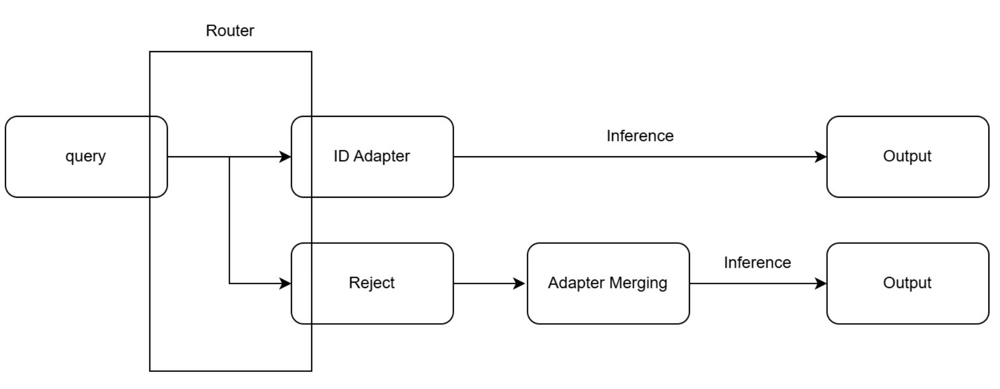

# SMoEA — Scalable Mixture-of-Experts Adapters

以「任務路由 ＋ 每任務 LoRA adapter」組成的可擴充專家系統：
query 進來先由 Router（嵌入相似度 margin ＋ Mondrian 共形校準 ＋
詞彙一致性 ＋ LLM 送審裁決）判定歸屬——已知任務路由到對應 adapter
生成；域外查詢選擇性拒絕、交由 Adapter Merging 分支處理。



## 目錄結構

```
main.py                     主程式：interactive / batch 兩模式（見 Quick Start）
configs/default.yaml        全部超參數（任務集合由 dataset 掃描自動推導）
router/                     路由決策層（圖中 Router 方塊；封板 v7 系統）
  config.py data_io.py embedding.py fingerprint.py units.py
  lexical.py conformal.py verifier.py core.py metrics.py
system/                     路由後的執行層
  inference.py              InferenceEngine：base model + adapter 熱切換生成
  rejection.py              拒絕分支接口（Adapter Merging，🚧 見開發狀態）
scripts/
  build_router_assets.py    路由資產離線建置一條龍
  eval_router.py            路由評測三段（decide → score → run）
  eval_baseline_*.py        兩支 baseline（Pure Embedding / BM25 Voting）
  verify_flow_table.py      六流向表獨立重放驗證
  plot_centroids.py         多質心結構圖
  selftest_*.py             三支自測（零資料零 GPU，環境驗收用）
dataset/train_data/task{N}_train.json      任務樣本（不進 git）
dataset/test_data/task{N}_test.json        ID 與 OOD 測試檔同放；
                                           只有測試檔的任務自動視為 OOD
adapter/task{N}/            LoRA adapters（不進 git）：目錄內直接放
                            adapter 檔，或多個 checkpoint-*/ 自動取最新
assets/                     路由建置產物 + unit_descriptions.json（單位說明書）
results/                    評測與批次輸出（不進 git）
docs/                       架構圖與文件
```

## Quick Start

```bash
pip install -r requirements.txt
python scripts/selftest_core_modules.py      # 環境驗收（零資料零 GPU）
python scripts/selftest_end_to_end.py
python scripts/selftest_main_pipeline.py

# 資料與 adapter 就位後（見上方目錄結構），建路由資產：
python scripts/build_router_assets.py

# 互動 demo：單筆 query 跑完整流程、顯示 Router 逐步判定
python main.py --mode interactive

# 批次：跑 dataset 測試檔（--tasks 3,7 限任務、--limit 50 試跑）
python main.py --mode batch
```

互動模式輸出範例：

```
> <query>
[Router] margin=0.183  p=0.42  詞彙一致✓
[Router] top-3：task23(sim 0.87)  task10(sim 0.71)  task24(sim 0.66)
[Router] 判定：綠區路由 → task23
[Output] <模型輸出>
```

## 開發狀態

| 元件 | 狀態 | 說明 |
|---|---|---|
| Router（路由決策） | ✅ 封板 | v7 系統；50 ID × 15 OOD 評測於 TWCC 完整重現（決定性層逐位一致），數字見 tag v7.0 |
| ID 路徑（adapter 載入＋生成） | ✅ | `system/inference.py`；生成設定照 MoEA-Trainer（貪婪、max_new_tokens=512、stop_strings） |
| 拒絕分支（Adapter Merging） | 🚧 | **入口 `system/rejection.py`**——合成/載入/生成機制已備妥（`InferenceEngine.load_adapters_merged`），待實作權重決策；診斷素材與驗收方式見該檔檔頭 |
| 評測 | ✅ | 六指標兩模式 + 六流向表獨立驗證 + 兩支 baseline |

## Router 指標（50 ID × 15 OOD、micro %；tag v7.0）

| | overall | id_task | id_unit | ID誤拒 | ood_all | 應拒 | 應路由 |
|---|---|---|---|---|---|---|---|
| Router | 87.2 | 87.2 | 91.3 | 5.6 | 73.6 | 72.1 | 85.6 |
| Pure Embedding τ=0.72 | 83.4 | 80.4 | 85.2 | 10.9 | 77.8 | 79.5 | 63.6 |
| BM25 Voting 0.5 | 77.5 | 78.9 | 79.3 | 18.3 | 71.6 | 78.0 | 19.3 |

紅區誤拒率 ≤ p_lo 為有限樣本精確保證（可交換前提由建置程序構造性
成立）；評測方法、單位/計算域定義見 `router/metrics.py` 檔頭與
`scripts/eval_router.py`。

## 資料格式

樣本檔 `{"task_key", "task_name", "definition", "instances": [...]}`，
每筆 instance 含 `input`（路由嵌入用）、`full_prompt`（生成 prompt）、
`output`、`instance_id`；亦相容純 array 與 JSONL。OOD 任務級標記檔
格式與評測兩模式見 `scripts/eval_router.py` 檔頭。
